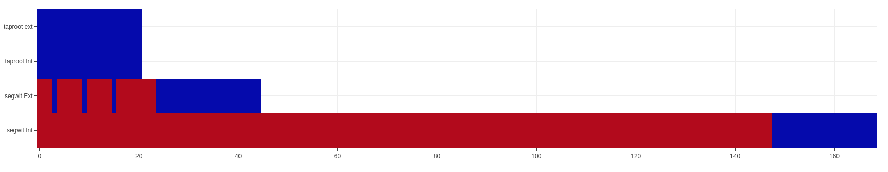
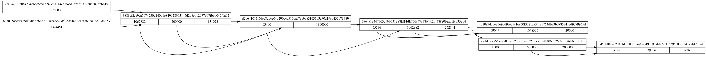

Wallet diagnostic
----------

Toolset for observe the internal state of wallets.

## MagicalCryptoWallet keys state generation

Create a visual representation from a MagicalCryptoWallet keys dump.

### How to run it

Run MagicalCryptoWallet, open the wallet you are interested in.

Next open a terminal and enter:

```bash
dotnet fsi keygraph.fsx <wallet-name>
```

### The result



### Dependencies

None

## MagicalCryptoWallet CoinGraph generation

Create a visual representation from a MagicalCryptoWallet coins dump.

### How to run it

Run MagicalCryptoWallet, open the wallet you are interested in.

Next open a terminal and enter:

```bash
dotnet fsi txgraph.fsx <wallet-name> <initial-txid> | dot -Tpng | feh  -
```

## The result



## Dependencies

- graphviz, required for dot
- feh
