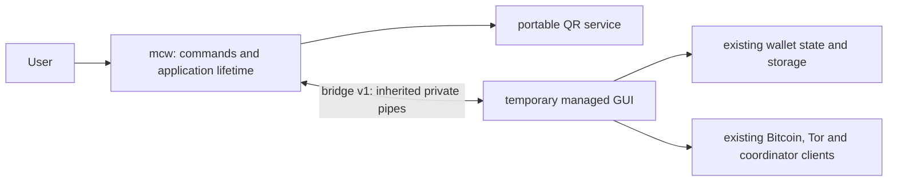

# mcw is the application

`mcw` is the permanent Rust application, built as one Cargo package and one shipping executable. Its first owned service is QR generation. During migration it hosts the existing managed GUI over one private, persistent pair of anonymous pipes. The coordinator remains an external service.

The eventual native UI calls the same portable Rust services directly. Delete the bridge and managed adapter once the last managed caller is migrated. Future subsystems get real implementations with verified callers; empty wallet/storage/network/UI modules are deliberately absent.

## Ownership and dependencies

- `command` owns public command dispatch: default/`gui`, `qr encode --ecc L|M|Q|H`, help and version.
- `app` owns the managed child's lifetime, exit status, restart, verified-update installation and crash-report handoff. Child arguments are preserved without a shell; executable lookup stays beside the host. Managed single-instance activation, data paths, silent startup and wallet locking retain their existing implementation.
- `qr` owns Model 2 versions 1–40, all correction levels, numeric/alphanumeric/UTF-8 byte modes, ECI 26 for non-ASCII input, Reed-Solomon interleaving, function patterns and deterministic minimum-penalty masking. It preserves the exact text, including whitespace and an explicitly supplied BOM.
- `bridge` translates typed frames into service calls. Domain code is independent of the transport and has `forbid(unsafe_code)`.
- `platform` contains native bindings, unsafe code, shutdown handlers, Windows job ownership and the first-party Windows runtime entry/TLS/memory boundary.
- The managed child exclusively owns wallet state, keys, schemas, synchronization and credentials. Its SafeFile adapter supplies already serialized bytes and an explicit path to the Rust file writer. Rust owns only that bounded write operation and its temporary stream; the managed reader and recovery policy remain authoritative.

Only Rust's standard library and native OS APIs are allowed. Cargo normal/build/test dependency sections remain empty. Replacing a dependency must include its non-OS dependencies in this same executable; no feature-specific companion program, native library or bundled runtime is an acceptable replacement. The existing managed and bundled programs remain explicit transitional components.

Rust is pinned to **1.99.0**, edition 2024. The five release targets are Windows x64, Linux x64/ARM64 and macOS x64/ARM64. Windows release builds rebuild the matching standard library with aborting panics and use first-party Rust PE entry, TLS, exit callbacks and memory primitives. They link native OS libraries without a static/copied Microsoft CRT or a VC++ Redistributable import. This requires the compiler's matching `rust-src` and scoped unstable Cargo `build-std`; it is not an external application dependency. Debug/test tools may use their toolchain runtime; only the audited release binary ships.

The Rust host and managed application share `ClientVersion` (development default `99.99.99`). The Cargo package version describes the source package; `mcw --version` reports the build's application version.

Linux release builds also rebuild the pinned standard library with aborting panics and backtrace support disabled. This removes the GCC unwinder runtime instead of bundling or statically linking it. OS libc remains the native baseline; the extracted ELF dependency audit rejects libgcc_s, libstdc++, OpenSSL and other non-OS libraries in the mcw executable.

Linux compatibility evidence must identify the build/test distribution and required
libc symbol versions. An OS-only import list does not prove compatibility with
older distributions. The Ubuntu 24.04 x64 CI snapshot tested during incorporation
requires GLIBC 2.32–2.34 symbols and cannot execute on the local Ubuntu 20.04
glibc 2.31 diagnostic environment. That local loader failure provides no host
lifecycle evidence; qualification uses the actual packaged target in CI.

The Linux compiler driver omits the aborting, backtrace-free standard library's unused `-lgcc_s` request and applies early `--as-needed`. This prevents GNU ARM linkers from retaining an empty GCC runtime dependency. With default linker libraries disabled, a genuinely needed unwinder symbol fails linking; the runtime audit also remains strict.

The shipping linker policy is passed through `cargo rustc` only to the final `mcw` binary. Compiler build helpers use the normal native compiler and the toolchain's prebuilt unwinding standard library; these build-only executables are never packaged.

## Bridge v1

Production adapters in `MagicalCryptoWallet/Mcw/<Service>/` depend on the core
`IMcwApplicationServices` contract, avoiding a core-to-client project cycle.
`McwApplicationServices.Current.RequestAsync(operation, payload, cancellation)`
uses the existing private connection, bounded pending table, typed error path
and cancellation/late-reply handling. The host adapter binds this connection
after its handshake and releases it on shutdown. It never starts another host
or transport and never falls back to managed implementations.

Operations below `0x0100` are reserved for QR/lifecycle; service adapters may
use QR operation 1 and their host-owner-assigned operations at or above
`0x0100`. An unregistered operation returns typed error 3. Each service owns a
bounded, versioned little-endian payload schema and Rust module dispatch leaf;
the host owner registers the operation in the shared dispatcher and ledger.
Worker modules and adapters may be prepared independently, but production
callers switch only with matching host registration and compatibility tests.
Secret payloads use this same pipe without logging or command-line copies.
Future entropy remains a platform responsibility and must return an error when
native OS entropy is unavailable; no entropy implementation is added by QR work.

The following service ranges are reserved for later bounded migrations.
Reserving a range implements no service, authorizes no whole-subsystem rewrite
and removes no dependency. The QR foundation now also hosts the bounded
integrations listed below. Later integrations should select independently
replaceable dependencies or small responsibilities with verified production
callers. Completed portable codec ranges `0x0200` to
`0x0500`, `0x0700` and `0x0800` remain reserved for their existing handoffs.

| Service | Operation range | Rust service / managed adapter leaves |
|---|---|---|
| JSON value codecs | 0x0100–0x01FF | Reserved; JSON engine present, retained-caller schema adapters pending |
| Transactions | 0x0600–0x06FF | `transaction_service` / `Mcw/Transactions` |
| Content decoding | 0x0900–0x09FF | `content_service` / `Mcw/Content` |
| Wallet cryptography/recovery | 0x0A00–0x0AFF | `wallet_crypto` / `Mcw/Crypto` |
| Secure networking | 0x0B00–0x0BFF | `network_service` / `Mcw/Network` |
| Nostr | 0x0C00–0x0CFF | `nostr_service` / `Mcw/Nostr` |
| Scripts | 0x0D00–0x0DFF | `script_service` / `Mcw/Scripts` |
| Synchronization | 0x0E00–0x0EFF | `sync_service` / `Mcw/Sync` |
| Privacy/Tor | 0x0F00–0x0FFF | `privacy_service` / `Mcw/Privacy` |
| Storage | 0x1000–0x10FF | `storage_service` / `Mcw/Storage` |
| Native UI | 0x1100–0x11FF | `native_ui` / `Mcw/NativeUi` |
| CoinJoin | 0x1200–0x12FF | `coinjoin_service` / `Mcw/CoinJoin` |
| Scanning | 0x1300–0x13FF | `scan_service` / `Mcw/Scanning` |

The former RPC candidate for this range is retired with the daemon/automation
API removal. It has no active caller or registered service; its old activation
patches must not be applied. The portable `json` engine remains a
prepared formats component; Newtonsoft.Json remains retained. Replacing a
retained JSON caller requires a new bounded compatibility proof and an atomic
caller/host integration.

Native UI/camera binding leaves belong under `mcw/src/platform/native_ui/` and
`mcw/src/platform/camera/`; storage byte-range locks belong under
`mcw/src/platform/storage/`. Portable UI/scanner/storage logic stays outside the platform
layer. Entropy, TLS/trust and native file-lock bindings similarly stay within
`platform`. Future leaves require a scoped migration request. Shared platform
exports and lifecycle registration remain host-owner integration changes.
Cancellation releases managed request IDs immediately and sends a kind-5 frame
with the original ID/operation; late responses are drained. A registered service
must connect this signal to its own bounded work/session cleanup.

The host's reader never waits for application dispatch. It admits at most 256
queued frames within a 16 MiB body-byte budget and keeps at most 256 distinct
cancellation controls. Cancellation removes matching queued work immediately;
control delivery takes priority after the handshake. In-flight QR work is bounded
by version 40 and may finish with a late reply. EOF or protocol failure discards
the backlog and requests graceful child cleanup. Queue overflow returns typed
resource-limit error 4 when a request can be identified, then shuts down the
connection. Request IDs are unique for the entire connection: the managed owner
allocates increasing IDs and never reuses a completed or canceled ID. Arrival
order also increases: allocation and the complete frame write share the managed
write lock. The native reader rejects reuse and non-increasing request IDs using
one scalar high-water mark, including IDs whose earlier work has completed.

Queued cancellation retains only a typed session/ticket prefix, clears the
discarded frame, and releases the actual PSBT, file, Tor or scanner resource.
The dispatcher retains at most 256 payload-free completion receipts for late
cancellation. Older unknown cancellation is harmless. A live per-request atomic
flag lets Markdown/Tor/content work observe reader-side CANCEL, EOF and overload
while dispatch is occupied. Scanner registration shares the same ingress and
signals its decoder handle immediately. Finish cleanup handles cancellation
between a service return and acknowledgement. Connection closure destroys every
connection-owned session and temporary stream.

All integers are little-endian. Each frame begins with a **u32 body length** in bytes, followed by this 16-byte header and its typed payload. Body length must be 16–1,048,576; validate it before allocation.

| Offset in body | Field |
|---|---|
| 0 | u16 protocol version, exactly 1 |
| 2 | u8 message kind |
| 3 | reserved u8, zero |
| 4 | u64 request ID |
| 12 | u16 operation |
| 14 | reserved u16, zero |
| 16 | operation payload |

Kinds: hello=1, response=2, request=3, error=4, cancel=5. The child sends hello with ID/operation zero and no payload before application initialization. The host acknowledges with a response using zero ID/operation. A crash-report bootstrap may carry a typed string list in the acknowledgement; exception payloads stay off the process command line. Other requests use nonzero IDs. Host-requested shutdown uses ID zero; after normal managed cleanup, the child sends a nonzero-ID shutdown request and waits for acknowledgement before closing the pipe. An unannounced successful child exit is a host failure.

| Operation | Request | Response |
|---|---|---|
| 1: QR | u8 ECC (L=0, M=1, Q=2, H=3), then strict UTF-8 text | u8 symbol version, u8 ECC, u16 width, width² row-major u8 modules (0/1) |
| 2: shutdown | empty | host to child: invoke termination; child to host: acknowledge completed cleanup with an empty response |
| 3: restart | typed string list of preserved arguments | empty acknowledgement; root waits for cleanup and relaunches |
| 4: install update | typed string list containing one absolute installer path | empty acknowledgement; root launches only after successful managed exit |
| 5: crash report | typed string list of report arguments | empty acknowledgement; root waits, then launches the existing report UI with bootstrap data in the pipe |

A string list is u32 count (maximum 256), then repeated u32 byte length plus strict UTF-8 bytes, with no NUL or trailing data. Error payloads are u16 code and a UTF-8 diagnostic: invalid request=1, capacity/content=2, unsupported operation=3. Diagnostics never echo input.

The managed adapter serializes writes so concurrent callers cannot interleave frames, validates response shape and operation IDs, and bounds outstanding requests. Disposal/cancellation releases pending completions immediately; late replies are drained. Failure closes admission before completing pending calls, including calls racing with disconnection. Native rejections expose `McwServiceException.Operation` and `.Code`; diagnostic payload text is validated and discarded. Request/frame/error buffers receive best-effort clearing, without a formal erasure claim. The host validates versions/header/operations, bounds its receive queue and uses a 15-second startup handshake deadline. A broken connection fails pending calls and triggers existing graceful termination. QR failures follow the existing receive-screen error dialog; there is no legacy fallback.

Asynchronous application callers await native service requests throughout their
transport path. The WabiSabi HTTP adapter resolves script rendering/parsing before
its retained synchronous schema codec runs; every script occurrence receives a
native result without a shared cache or a managed fallback. A pending Rust reply
must leave the HTTP entry point asynchronous. Cancellation and malformed/native
failures propagate explicitly instead of returning a null round-state response.

## Bounded services in the same application

These integrations migrate actual callers together with host dispatch. They do
not confer ownership of an entire wallet, network, UI or storage subsystem.
The [current incorporation record](../Contrib/McwMigration/incorporated-flows.json)
identifies exact callers and remaining dependencies. Individual handoff documents
retain their historical component evidence; their earlier pending statements
refer to those checkpoints rather than the current composition.

| Responsibility | Active native boundary | Authority retained elsewhere |
|---|---|---|
| PSBT metadata | `0x0600–0x0606`, inspection/enrichment and bounded transfers | Managed builder, signer, policy checks, keys and typed NBitcoin results |
| Ownership/SLIP21 MACs | `0x0A10–0x0A12`, exact HMAC-SHA256/SHA512 results | KeyManager and spend authorization |
| Safe-file writes | `0x1000–0x1004`, staged bytes, flush and existing rename sequence | Managed serialization, paths, reads and recovery choice |
| Round fingerprints | `0x1200`, client validation before accepting new rounds | External coordinator calculation and managed client round state |
| Fee response decoding | `0x0900`, bounded reverse gzip/zlib/Brotli content layers | Managed HTTP/TLS, routes, retries and all other response paths |
| HTTP factory contract | Application-owned `IMcwHttpClientFactory`; no native opcode | Existing transport implementation and external ASP.NET framework role |
| Tor control/readiness | `0x0F00–0x0F04` parsing/read sessions; `0x0805` loopback SOCKS readiness | Bundled Tor daemon, managed sockets/control policy, explicit managed coordinator overrides |
| Acquired QR images | `0x1300–0x1303`, staged luminance and decoding | FlashCap camera capture, Skia image conversion and user scan flow |
| Release highlights | `0x1100`, bounded Markdown presentation | Existing Avalonia text/link controls, theme, navigation and dialog |
| Address validation | `0x020C`, network-aware validation and script bytes | Managed address objects, URI policy and wallet derivation |
| Block cache identity | `0x0E00`, hash of the exact 80-byte header | Managed block parsing, consensus checks, cache and synchronization |
| Client script text | `0x0D08–0x0D09`, parse/render | Managed Script values, signatures and external coordinator serialization |
| Compact filter matching | `0x0702`, canonical filter and candidate matching | Managed heights, retries, reorg and synchronization state |
| Nostr event ID | `0x0C00`, exact canonical event digest | Managed relay/update policy, retained BIP340 verification and NNostr |

The JSON/hash/wire primitives used by these services are internal modules. They
add no public modes, additional connection, Cargo dependency or shipping binary.
When a UI becomes native it calls these same domain APIs directly.

`Contrib/Mcw/test-migrations.py` compiles the current callers and exercises the
supplied shipping host, including signed/unsigned PSBT construction, >1 MiB
metadata, independent MAC vectors, round acceptance, Tor reply fixtures,
historical Markdown semantics, acquired images, client serialization and Nostr
verification. The native tests synchronize actual ingress interruption with
Markdown/Tor progress and scanner threshold execution. Content verification
separately requires positive partial input/output counters in a native failure
reply; its shipping schedule search is distinct from its deterministic component
checkpoint test. All five package jobs run these current-source proofs.

Safe-file tests cover synthetic interrupted writes and artifact/recovery order.
They do not certify persistence through a physical power loss. No wallet schema
or storage ownership migration is implied by replacing the file-operation leaf.

Ordinary managed console output is redirected to stderr before startup logging. stdout is exclusively the saved binary pipe. QR and lifecycle payloads never appear in logs or command arguments. Legacy user-supplied flags retain their existing semantics and are forwarded as application arguments.

The host reaps its child on normal exit and every error path. Windows puts the child/descendants in a private kill-on-close job, preventing orphans after host death. Unix SIGINT/SIGTERM requests orderly shutdown; abrupt parent death closes the pipes and the managed reader invokes termination. A child that fails to exit after 120 seconds is forcibly terminated and the host returns failure. The managed crash reporter remains responsible for rendering crash reports.

## Launch, build and packages

Users launch `mcw`; the `magicalcryptowallet` compatibility launcher delegates to the same desktop. Windows MSI shortcuts/install-on-finish, Linux desktop/AppRun/bin links, macOS bundle metadata, startup registration and restart paths use `mcw`. App identity, icons, data-directory rules and installer/update identity are preserved.

`python Contrib/Releases/setup-tools.py --rid <rid>` provisions the checksum-verified Rust toolchain plus existing release tools into the build workspace. `Contrib/Mcw/build.py` verifies Cargo metadata, builds and audits the binary; `--test` also runs formatting, strict Clippy and Rust tests. Desktop MSBuild output copies the release host beside the apphost; set `BuildMcwHost=false` only when an outer package build supplies the host. Standalone QR mode works without any managed files.

`Contrib/Releases/package.py` builds Rust alongside the managed/native application and keeps required transitional components. CI runs native Rust tests, an actual host/managed pipe probe with independent QR decoding, receive-control/PNG pixel checks, synthetic wallet process tests and extracted package audits on all five platforms. `Contrib/Mcw/audit.py` records binary SHA/version/imports; Cargo metadata alone is never dependency-removal evidence.

## Later migrations

For every migration, record behavior to preserve, Rust owner, caller interface, compatibility requirements and verification evidence in the [migration ledger](McwMigration.md). Keep a single authoritative owner for every stateful subsystem. Introduce state ownership changes only after explicit storage compatibility, recovery and crash-safety proof. Hardware integration is a future boundary; the current product remains [software-wallet-only](SoftwareWallet.md).

The coordinator, regtest Bitcoin Core, release signing/publishing tools and compiler/test tools have separate roles. A client codec migration does not remove those services or their dependencies. A module-only implementation does not remove a still-used upstream package.
