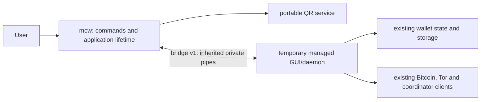

# mcw is the application

`mcw` is the permanent Rust application, built as one Cargo package and one shipping executable. Its first owned service is QR generation. During migration it hosts the existing managed GUI or daemon over one private, persistent pair of anonymous pipes. The coordinator remains an external service.

The eventual native UI calls the same portable Rust services directly. Delete the bridge and managed adapter once the last managed caller is migrated. Future subsystems get real implementations with verified callers; empty wallet/storage/network/UI modules are deliberately absent.

## Ownership and dependencies

- `command` owns public command dispatch: default/`gui`, `daemon`, `qr encode --ecc L|M|Q|H`, help and version.
- `app` owns the managed child's lifetime, exit status, restart, verified-update installation and crash-report handoff. Child arguments are preserved without a shell; executable lookup stays beside the host. Managed single-instance activation, data paths, silent startup and wallet locking retain their existing implementation.
- `qr` owns Model 2 versions 1–40, all correction levels, numeric/alphanumeric/UTF-8 byte modes, ECI 26 for non-ASCII input, Reed-Solomon interleaving, function patterns and deterministic minimum-penalty masking. It preserves the exact text, including whitespace and an explicitly supplied BOM.
- `bridge` translates typed frames into service calls. Domain code is independent of the transport and has `forbid(unsafe_code)`.
- `platform` contains native bindings, unsafe code, shutdown handlers, Windows job ownership and the first-party Windows runtime entry/TLS/memory boundary.
- The managed child exclusively owns wallet state, keys, files, synchronization and credentials for this milestone. The Rust host neither opens nor rewrites wallet data.

Only Rust's standard library and native OS APIs are allowed. Cargo normal/build/test dependency sections remain empty. Replacing a dependency must include its non-OS dependencies in this same executable; no feature-specific companion program, native library or bundled runtime is an acceptable replacement. The existing managed and bundled programs remain explicit transitional components.

Rust is pinned to **1.99.0**, edition 2024. The five release targets are Windows x64, Linux x64/ARM64 and macOS x64/ARM64. Windows release builds rebuild the matching standard library with aborting panics and use first-party Rust PE entry, TLS, exit callbacks and memory primitives. They link native OS libraries without a static/copied Microsoft CRT or a VC++ Redistributable import. This requires the compiler's matching `rust-src` and scoped unstable Cargo `build-std`; it is not an external application dependency. Debug/test tools may use their toolchain runtime; only the audited release binary ships.

The Rust host and managed application share `ClientVersion` (development default `99.99.99`). The Cargo package version describes the source package; `mcw --version` reports the build's application version.

Linux release builds also rebuild the pinned standard library with aborting panics and backtrace support disabled. This removes the GCC unwinder runtime instead of bundling or statically linking it. OS libc remains the native baseline; the extracted ELF dependency audit rejects libgcc_s, libstdc++, OpenSSL and other non-OS libraries in the mcw executable.

## Bridge v1

Production adapters in `MagicalCryptoWallet/Mcw/<Service>/` depend on the core
`IMcwApplicationServices` contract, avoiding a core-to-client project cycle.
`McwApplicationServices.Current.RequestAsync(operation, payload, cancellation)`
uses the existing private connection, bounded pending table, typed error path
and cancellation/late-reply handling. The host adapter binds this connection
after its handshake and releases it on shutdown. It never starts another host
or transport and never falls back to managed implementations.

Operations below `0x0100` are reserved for QR/lifecycle; service adapters may
use QR operation 1 and their host-owner-assigned operations at or above
`0x0100`. An unregistered operation returns typed error 3. Each service owns a
bounded, versioned little-endian payload schema and Rust module dispatch leaf;
the host owner registers the operation in the shared dispatcher and ledger.
Worker modules and adapters may be prepared independently, but production
callers switch only with matching host registration and compatibility tests.
Secret payloads use this same pipe without logging or command-line copies.
Future entropy remains a platform responsibility and must return an error when
native OS entropy is unavailable; no entropy implementation is added by QR work.

The following service ranges are reserved for later bounded migrations.
Registration is a separate integration change; reserving a range implements no
service, authorizes no whole-subsystem rewrite and removes no dependency. This
milestone switches QR only. Later integrations should select independently
replaceable dependencies or small responsibilities with verified production
callers. Completed portable codec ranges `0x0200` to
`0x0500`, `0x0700` and `0x0800` remain reserved for their existing handoffs.

| Service | Operation range | Rust service / managed adapter leaves |
|---|---|---|
| Serialization | 0x0100–0x01FF | `serialization_service` / `Mcw/Serialization` |
| Transactions | 0x0600–0x06FF | `transaction_service` / `Mcw/Transactions` |
| Content decoding | 0x0900–0x09FF | `content_service` / `Mcw/Content` |
| Wallet cryptography/recovery | 0x0A00–0x0AFF | `wallet_crypto` / `Mcw/Crypto` |
| Secure networking | 0x0B00–0x0BFF | `network_service` / `Mcw/Network` |
| Nostr | 0x0C00–0x0CFF | `nostr_service` / `Mcw/Nostr` |
| Scripts | 0x0D00–0x0DFF | `script_service` / `Mcw/Scripts` |
| Synchronization | 0x0E00–0x0EFF | `sync_service` / `Mcw/Sync` |
| Privacy/Tor | 0x0F00–0x0FFF | `privacy_service` / `Mcw/Privacy` |
| Storage | 0x1000–0x10FF | `storage_service` / `Mcw/Storage` |
| Native UI | 0x1100–0x11FF | `native_ui` / `Mcw/NativeUi` |
| CoinJoin | 0x1200–0x12FF | `coinjoin_service` / `Mcw/CoinJoin` |
| Scanning | 0x1300–0x13FF | `scan_service` / `Mcw/Scanning` |

Native UI/camera binding leaves belong under `mcw/src/platform/native_ui/` and
`mcw/src/platform/camera/`; storage byte-range locks belong under
`mcw/src/platform/storage/`. Portable UI/scanner/storage logic stays outside the platform
layer. Entropy, TLS/trust and native file-lock bindings similarly stay within
`platform`. Future leaves require a scoped migration request. Shared platform
exports and lifecycle registration remain host-owner integration changes.
Cancellation releases managed request IDs immediately and sends a kind-5 frame
with the original ID/operation; late responses are drained. A registered service
must connect this signal to its own bounded work/session cleanup.

All integers are little-endian. Each frame begins with a **u32 body length** in bytes, followed by this 16-byte header and its typed payload. Body length must be 16–1,048,576; validate it before allocation.

| Offset in body | Field |
|---|---|
| 0 | u16 protocol version, exactly 1 |
| 2 | u8 message kind |
| 3 | reserved u8, zero |
| 4 | u64 request ID |
| 12 | u16 operation |
| 14 | reserved u16, zero |
| 16 | operation payload |

Kinds: hello=1, response=2, request=3, error=4, cancel=5. The child sends hello with ID/operation zero and no payload before application initialization. The host acknowledges with a response using zero ID/operation. A crash-report bootstrap may carry a typed string list in the acknowledgement; exception payloads stay off the process command line. Other requests use nonzero IDs. Host-requested shutdown uses ID zero; after normal managed cleanup, the child sends a nonzero-ID shutdown request and waits for acknowledgement before closing the pipe. An unannounced successful child exit is a host failure.

| Operation | Request | Response |
|---|---|---|
| 1: QR | u8 ECC (L=0, M=1, Q=2, H=3), then strict UTF-8 text | u8 symbol version, u8 ECC, u16 width, width² row-major u8 modules (0/1) |
| 2: shutdown | empty | host to child: invoke termination; child to host: acknowledge completed cleanup with an empty response |
| 3: restart | typed string list of preserved arguments | empty acknowledgement; root waits for cleanup and relaunches |
| 4: install update | typed string list containing one absolute installer path | empty acknowledgement; root launches only after successful managed exit |
| 5: crash report | typed string list of report arguments | empty acknowledgement; root waits, then launches the existing report UI with bootstrap data in the pipe |

A string list is u32 count (maximum 256), then repeated u32 byte length plus strict UTF-8 bytes, with no NUL or trailing data. Error payloads are u16 code and a UTF-8 diagnostic: invalid request=1, capacity/content=2, unsupported operation=3. Diagnostics never echo input.

The managed adapter serializes writes so concurrent callers cannot interleave frames, validates response shape and operation IDs, and bounds outstanding requests. Disposal/cancellation releases pending completions immediately; late replies are drained. The host validates versions/header/operations, bounds its receive queue and uses a 15-second startup handshake deadline. A broken connection fails pending calls and triggers existing graceful termination. QR failures follow the existing receive-screen error dialog; there is no legacy fallback.

Ordinary managed console output is redirected to stderr before startup logging. stdout is exclusively the saved binary pipe. QR and lifecycle payloads never appear in logs or command arguments. Legacy user-supplied flags retain their existing semantics and are forwarded as application arguments.

The host reaps its child on normal exit and every error path. Windows puts the child/descendants in a private kill-on-close job, preventing orphans after host death. Unix SIGINT/SIGTERM requests orderly shutdown; abrupt parent death closes the pipes and the managed reader invokes termination. A child that fails to exit after 120 seconds is forcibly terminated and the host returns failure. The managed crash reporter remains responsible for rendering crash reports.

## Launch, build and packages

Users launch `mcw`; `mcw daemon` selects the managed daemon. Old `magicalcryptowallet` and `magicalcryptowalletd` launchers delegate to it. Windows MSI shortcuts/install-on-finish, Linux desktop/AppRun/bin links, macOS bundle metadata, startup registration and restart paths use `mcw`. App identity, icons, data-directory rules and installer/update identity are preserved.

`python Contrib/Releases/setup-tools.py --rid <rid>` provisions the checksum-verified Rust toolchain plus existing release tools into the build workspace. `Contrib/Mcw/build.py` verifies Cargo metadata, builds and audits the binary; `--test` also runs formatting, strict Clippy and Rust tests. Desktop/daemon MSBuild output copies the release host beside the apphost; set `BuildMcwHost=false` only when an outer package build supplies the host. Standalone QR mode works without any managed files.

`Contrib/Releases/package.py` builds Rust alongside the managed/native application and keeps required transitional components. CI runs native Rust tests, an actual host/managed pipe probe with independent QR decoding, receive-control/PNG pixel checks, synthetic wallet process tests and extracted package audits on all five platforms. `Contrib/Mcw/audit.py` records binary SHA/version/imports; Cargo metadata alone is never dependency-removal evidence.

## Later migrations

For every migration, record behavior to preserve, Rust owner, caller interface, compatibility requirements and verification evidence in the [migration ledger](McwMigration.md). Keep a single authoritative owner for every stateful subsystem. Introduce state ownership changes only after explicit storage compatibility, recovery and crash-safety proof. Hardware integration is a future boundary; the current product remains [software-wallet-only](SoftwareWallet.md).

The coordinator, regtest Bitcoin Core, release signing/publishing tools and compiler/test tools have separate roles. A client codec migration does not remove those services or their dependencies. A module-only implementation does not remove a still-used upstream package.
