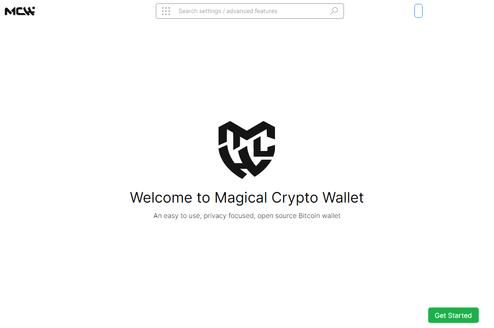
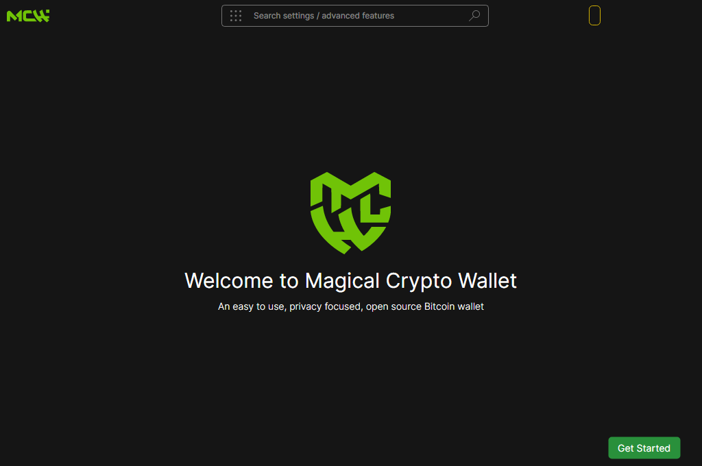
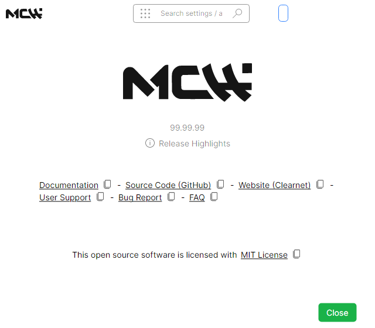
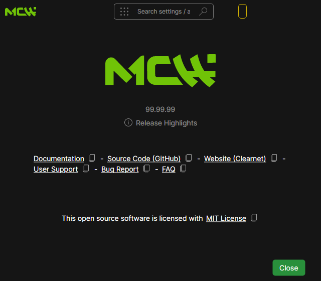

# Rebrand validation

The rebrand uses independent application storage, executable names, installer identities, signing keys, update author identity, and repository destinations. Protocol names and wallet formats remain unchanged.

## Verified locally

| Check | Result |
|---|---|
| Wallet unit tests | 1,080 passed, none skipped |
| Vendored managed cryptography | 125 passed |
| Native/managed interoperability | 34 passed on Windows |
| Source-built native C tests | Passed on Windows and Linux |
| Immutable cryptographic sources and published vectors | 56 files match the pinned source, allowing the randomness identifier and attribution comments |
| Immutable wallet fixtures | All three inherited JSON fixtures match the original source |
| Tracked source and current generated code | Passed; 41 individually recorded old-name exceptions |
| Windows MSI and ZIP | Built, extracted, and audited; 455 MSI payload files match published files |
| Application metadata, resources and symbols | Seven application assemblies and five symbol sets passed per extracted Windows payload |
| Fresh storage, explicit synthetic wallet import, independent locks, startup entries, fee defaults | Covered by passing wallet tests |
| Update authentication | Valid signatures accepted; tampering, wrong signing keys, wrong announcement authors, forged authors, duplicate tags and wrong destinations rejected |
| Actual application views | Welcome, About and title bar rendered in both themes at 100, 125, 150 and 200 percent |
| Logo proportions and geometry | Cropped compact/horizontal masks match source artwork at 99.8%/99.6%; tiny icons inspected at 16–64 pixels |

## CI delivery

The Build and audit workflow builds and extracts `win-x64`, `linux-x64`, `linux-arm64`, `osx-x64`, and `osx-arm64` packages. Each platform runs wallet, managed cryptographic and native interoperability tests, source/generated/assembly/resource/symbol audits, and actual application view rendering. Windows additionally installs both products on an ephemeral runner and checks independent installer registration. Separate jobs build the coordinator container and the Nix package.

Results and downloadable artifacts will be linked here after the draft pull request's exact commit completes CI. Snapshot packages use the existing development version `99.99.99`; they are not production platform signed.

## Signing and scope

Independent update, Nostr announcement and GPG public keys are committed in `Contrib/Signing/public-keys.json` and `PGP.txt`. Four repository-specific GitHub Actions secrets hold the private signing configuration. The encrypted local keystore is outside the checkout and OneDrive, under the current user's local application data directory. See [signing and recovery](../Contrib/Signing/README.md).

Production Windows/macOS certificates remain to be configured. Production packaging refuses missing platform identities. The release preparation workflow produces verified signed manifests and an authenticated announcement file; it does not publish a release or send an announcement.

The historical indexer backend was already excluded from the inherited solution and depends on removed core types. Its source has been rebranded and its status documented in [the backend README](../MagicalCryptoWallet.Backend/README.md); the supported server target is the coordinator.

Original notices, source provenance and audit negative data are the only remaining old-name occurrences. Every occurrence is bound to its path and exact line hash in [the exception registry](../Contrib/Rebrand/exceptions.json).

## Screenshots

| Light | Dark |
|---|---|
|  |  |
|  |  |
