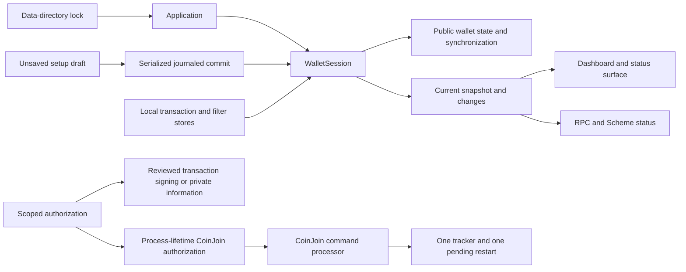

# Application lifetime wallet

The desktop and daemon share one `WalletSession`, configured for one Bitcoin network and one data directory. The session starts after local stores initialize. A window, navigation entry, and passphrase are unnecessary for public synchronization.

Previously the application owned a manager, a repository, a login state, and a loading workflow. A navigation page decided when to load; UI CoinJoin timers decided when to start. Collection wrappers, wallet identities, selection flags, and event filters routed those operations. The new setup service creates drafts; the session owns runtime resources; the dashboard presents state; the CoinJoin service owns orchestration.

## State and initialization

`Unconfigured`, `Loading`, `Syncing`, `Ready`, `Offline`, `Faulted`, and `Stopping` describe runtime state. Authorization is independent. `HasCachedData` separates an unknown balance from an initialized zero balance; synchronization heights and account coverage determine readiness. Late subscribers receive the current snapshot immediately. A broken observer cannot prevent delivery to other observers.

Local confirmed and mempool transactions initialize before network synchronization. Historical replay does not produce new-activity notifications. Public receive addresses and cached history work before readiness. Transaction construction, signing, broadcasting, fee changes, and CoinJoin enforce readiness in services as well as controls. A legacy wallet missing additional public account metadata synchronizes known accounts, requests interactive authorization, and rescans before reporting complete coverage.

Startup is idempotent and cancellation-aware. Unavailable peers or blocks produce recoverable offline state; a block retry never advances height. Loading faults expose their error. Recovery quiesces CoinJoin, disposes the previous wallet and worker, reconstructs fresh resources, and publishes a new model. Local store failures remain faulted if retry cannot repair them. Recovery starts at the earliest supported checkpoint when account coverage is unknown.

## Authorization and CoinJoin

`WalletAuthorization` validates each supplied passphrase and owns the decrypted key references for one operation. Ordinary previews and PSBTs use public account data; signing consumes the reviewed PSBT without rebuilding its recipient, inputs, or fee. Normal sending, RBF/CPFP, batching, recovery verification, and private information follow explicit authorization paths. Only software wallets with encrypted private keys and a valid 32-byte chain code are accepted. Every signing operation uses local passphrase authorization.

There is no application-wide password or logged-in shortcut. Wallet Info opens with public data and obtains private data only after authorization. Chinese masking and compatibility passwords remain in the dialogs. Empty-passphrase authorization actually verifies the wallet instead of inspecting an empty in-memory field.

Every successful passphrase authorization, including Send, private information, and RPC signing, also retains a separate CoinJoin scope for the current process. With automatic CoinJoin enabled, it starts when synchronization and send/shutdown restrictions allow. This does not authorize later sends or private-key disclosure: each operation still validates its own passphrase. Manual pause and disabled automatic CoinJoin remain respected. Hiding and showing a window retains CoinJoin authorization; restarting does not. Hidden startup opens no authorization dialog. Empty-passphrase wallets can automatically CoinJoin according to their settings, with the existing randomized startup delay. Retry timing remains unchanged.

The CoinJoin mailbox serializes start, stop, completion, retry, synchronization, and restriction changes. There is one tracker, restart task, client snapshot, critical coin collection, and coordination state. Sending and shutdown restrictions are independent; releasing one cannot release the other. Sending waits for critical-phase completion and payment reconciliation. Manual stopping cancels pending automatic resumes. Round, participant, input, and output collections remain protocol requirements.

## Desktop lifetime

The lock is acquired before constructing wallet services or mutable stores. A current-user-only named pipe accepts a fixed activation message for the locked data directory and exact network. Foreground launching activates the existing desktop; duplicate silent launching exits quietly. Requests arriving during initialization queue for the UI. A daemon or another network produces an explicit conflict.

Startup registration contains the current executable, resolved data directory, network, and exactly parsed `startsilent` argument. Arguments are quoted for each operating system. Reading settings does not modify startup registration; an enabled registration is refreshed and user preference changes apply normally. Lurking Wife Mode is configured before balance rendering and suppresses private search and transaction notifications.

Closing a window with hide-on-close enabled keeps the session. Reopening presents the existing dashboard. Quit first coordinates CoinJoin shutdown, then cancels synchronization and disposes workers, subscriptions, credentials, and the data-directory lock. Restart keeps the original explicit context and foreground startup arguments.

## Removed code

- Runtime wallet IDs, names, counters, renaming, selection, collections, and wallet-targeted event routing.
- Login and naming pages; login/logout models; loading-page ownership and navigation page switching.
- Wallet-selection adapters, hardware lookup for opening an existing wallet, redundant service forwarding, and unused generated navigation entries.
- Global passphrase/decrypted-key caches and Boolean authorization shortcuts.
- Wallet-indexed CoinJoin dictionaries, aggregated state, and UI automatic-start ownership.
- Explicit application load commands, named endpoint routes, and obsolete Scheme exports.

Software-wallet file formats, recovery and multi-share backup formats, transaction selection, read-only coin presentation, Bitcoin Core test-wallet commands, and independent regtest participants remain supported. Hardware and watch-only wallets and external PSBT signing are removed; internal PSBTs still support previews and local signing. WabiSabi cryptographic algorithms, wire formats, domain-separation constants, and published vectors are unchanged.

See [storage and API migration](SingleWallet.md) and [verification record](SingleWalletValidation.md).
